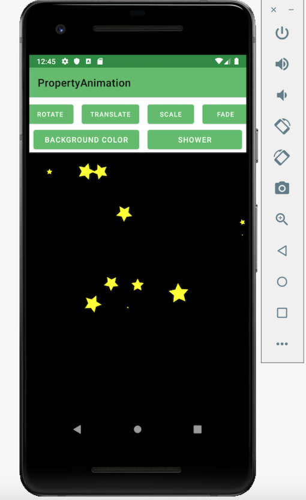

:cartwheeling: PropertyAnimation 
============================================================================

:eyeglasses: Introduction
------------

PropertyAnimation is an app that shows various types of property animations using
ObjectAnimator, Animator Set, and its method to showcase how animations work with 
Android and Kotlin.

:clapper: Animation
------------

This application demonstrates how to properly use:

- Rotation
- Translation
- Scale
- Fade
- Colorized
- Shower of drawable object

## :camera_flash: Screenshots

